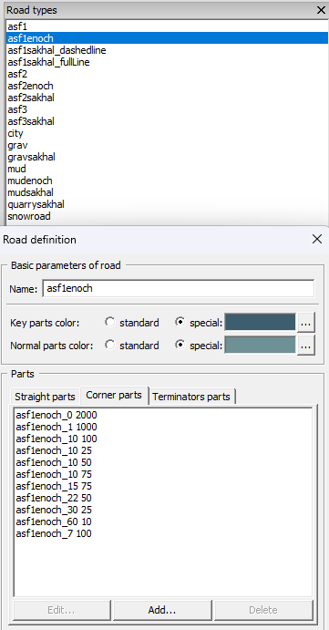

# tv4p-road-tool

<!-- markdownlint-disable-next-line MD033 -->


Utility for DayZ/Arma modders who are tired of adding road models one by one.
Terrain Builder stores Road Tool definitions inside the binary `.tv4p`
project file, so this tool reads, generates, and patches that block directly.

Why this exists:

* Road types in Road Tool are not import/export friendly in the UI.
* Defining a single road set can take hundreds of clicks.
* A proper road library is the foundation for any map team work.

What it does:

* **Extract** an existing road setup from a `.tv4p` file into YAML/JSON.
* **Generate** a new setup from `.p3d` files on disk.
* **Patch** a `.tv4p` with either an extracted or generated config.
* **Auto-colors** road types based on their names (with sensible defaults).

> [!WARNING]  
> This tool edits binary `.tv4p` files and can break a project.  
> Always keep a backup of the original file.

## Workflow

### Extract (backup + reuse)

Exports road types from a `.tv4p` file.  
Use this to reuse same road setup in another map or to share it with someone.  
This is also your safety backup of Road Tool settings.

```shell
./tv4p-road-tool extract myworld.tv4p roads-myworld.yaml
```

```powershell
.\tv4p-road-tool.exe extract myworld.tv4p roads-myworld.yaml
```

Extracted configs include internal fields (IDs/types)
that are **not** present in generated configs.

### Generate (from files)

Builds a config by scanning `.p3d` files on disk.  
If you use modded roads, list **all** their directories explicitly with `-p`.

> [!TIP]  
> Add `-v` to see per-file decisions and a summary.

```shell
./tv4p-road-tool generate -g /home/user/p_drive/ roads-generated.yaml
```

```powershell
.\tv4p-road-tool.exe generate -g P:\ roads-generated.yaml
```

The output YAML/JSON is editable,
but avoid touching fields you don’t understand.

> [!IMPORTANT]  
> Road Tool requires **MLOD** road models (not ODOL).  
> Use the MLOD road parts from [DayZ-Misc] and put them into your game root:
>
> * `dz/structures/roads/parts`
> * `dz/structures_bliss/roads/parts`
> * `dz/structures_sakhal/roads/parts`

### Patch (apply to tv4p)

Apply either an extracted config or a generated config to a `.tv4p` file.

```shell
./tv4p-road-tool patch myworld.tv4p roads-generated.yaml myworld-patched.tv4p
```

```powershell
.\tv4p-road-tool.exe patch myworld.tv4p roads-generated.yaml myworld-patched.tv4p
```

> [!CAUTION]  
> After patching, verify not only Road Tool but also other project data
> (rasters, layers, templates). If something disappears, restore your backup.

## Naming rules for generated parts

The generator uses file names to determine part types:

* `<type>_<len>.p3d` -> straight part
* `<type>_<len> <radius>.p3d` -> corner part
* `<type>_<len>konec.p3d` -> terminator part
* `<type>_<len>_crosswalk.p3d` -> crosswalk (still goes into straight parts)

Crossroads (`kr_t_*`, `kr_x_*`) are parsed and logged,
but not written to tv4p yet.

## What I learned about tv4p (short version)

* Road types live inside a tagged list (`0x88/0x0C`) of entries.
* Each entry has an ID and fields; each road part also an entry with its own ID.
* When the road list size changes, two offsets in the file must be adjusted.
  If they are wrong, Terrain Builder opens but silently drops other settings.
* Straight parts have an extra byte field that **must not** appear
  in corner/terminator parts.
* IDs must be unique;
  the tool generates deterministic IDs and avoids collisions.

[DayZ-Misc]: https://github.com/BohemiaInteractive/DayZ-Misc
